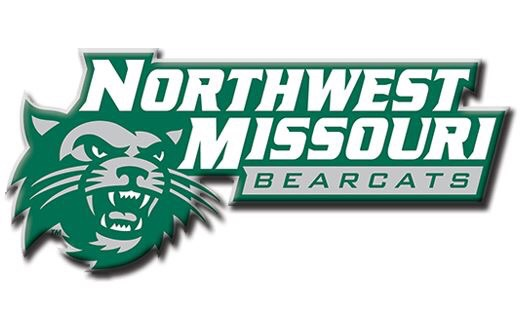

# Hari Hara Mummadi
Myself Harihara,I am from Hyderabad,Telangana,India.I have done my Bachelor's in Electrical and Electronics Engineering from CVR College of Engineering.I have graduated in the year 2019.After the completion of my bachelors , I have started to build my own Buniness i.e on Distribution of Products to Commercial Markets.Besides this I have learnt few foundation courses which are helpful to ease my course work load which made me to choose Master's in Applied Computer Science in Northwest Missouri State University located in Maryville,MO 64468.With these knowledge I will end-up as Well-rounded Business IT Professional and my primary areas of Interest is to work as Database Administrator or Videogame Developer.

